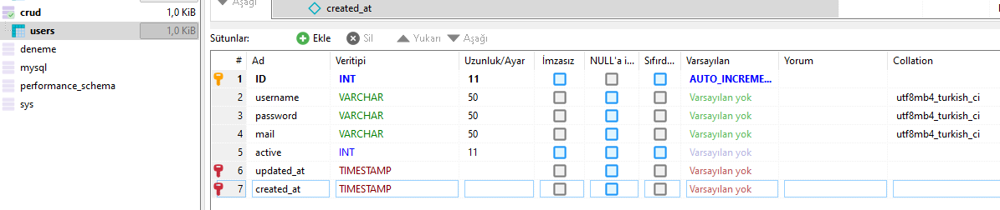
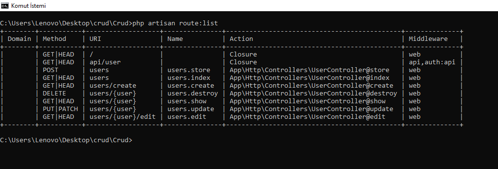
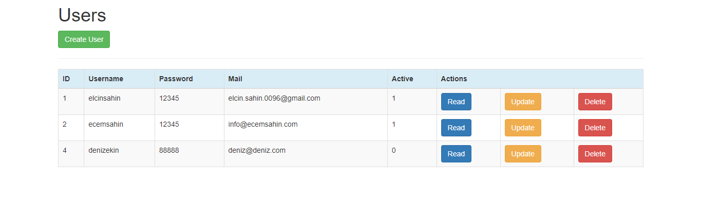

# Laravel Crud İşlemleri
Laravel, Taylor Otwell tarafından hazırlanan ve MVC mimari desenini takiben web uygulamalarının geliştirilmesi için tasarlanmış, açık kaynak kodlu bir PHP web uygulamasıdır. "PHP framework for Web Artisans" slaganı ile yola çıkar. Laravel öğrenilmesi kolay olmakla birlikte, dokümantasyonuna https://laravel.com/docs/9.x adresinden ulaşılabilir.

# CRUD Nedir?
Programlamada oluşturma, okuma, güncelleme ve silme (Create, Read, Update, Delete), gibi veri depolamada kullanılan dört temel fonksiyondur. Aşağıda “Crud” işlemleri adında örnek  proje sayfası oluşturularak temel işlemler ele alıncaktır.

## 1.	Composer ile Laravel projesi oluşturulur
Aşağıdaki komutla Crud isimli laravel projesi oluşturulur.

```
composer create-project laravel/laravel Crud prefer-dist
composer update komutu ile dependencyler yüklenir/güncellenir
```


## 2.	Proje Klasörüne Gidip Proje Çalıştırılır
```
cd Crud
php artisan serve

```
  İnternet tarayıcısından localhost:8000 adresine gidildiğinde sayfa açılacaktır.
  
## 3.Komut sistemine giderek oluşturmak istenen tablo adı belirlenerek aşağıda belirtilen şekilde yazılır.

```
php artisan make: migration –create=crud

```
## 4. Veri tabanı oluşturulur

 Crud adında bir veritabanı oluşturulmuş ve users adındaki tablo eklenmiştir.
 
 
 
## 5.Veritabanı ile Laravel projesi bağlanır.
Uygulamamızın ana dizinindeki .env dosyasında aşağıdaki alanlarda değişiklikler yapılır.

```
APP_NAME=Crud 

DB_CONNECTION=mysql
DB_HOST=127.0.0.1
DB_PORT=3306
DB_DATABASE=crud
DB_USERNAME=root
DB_PASSWORD=

```

### 6. User Controller Oluşturulması

Projenin ana dizinindeyken aşağıdaki komutu çalıştırıp, `UserController` oluşturacağız.

`php artisan make:controller UserController`

Daha sonra HTTP'nin altında bulunan Controller'da komut işlemleri yapılacak.

```php
<?php 
namespace App\Http\Controllers;

use App\Http\Requests;
use App\Http\Controllers\Controller;
use Request;

class UserController extends Controller {

   public function index()
   {
      // users oluşturulanları çektik.
   }
   public function create()
   {
      // Creat işlemleri yazılacacaktır.
   }
   
   public function show($id)
   {
      // görüntüleme nmetodu uygulandı.
   }

   public function update($id)
   {
      // güncelleme işlemlerinın yapıldığı komut satırı.
   }
   
   public function destroy($id)
   {
      // delete komutu uygulandı.
   }
}
```


### 7. User Model Oluşturulması

Aşağıdaki komutla `User` modelini oluşturacağız. Veritabanındaki tablonun 

`php artisan make:model User`

Komutu çalıştırdıktan sonra, `App'in içinde user.php` dosyasının oluştuğunu göreceğiz.

### 8. Form ve HTML Facade yüklenmesi

Aşağıdaki komutla *facade*leri yüklüyoruz.

`composer require laravelcollective/html`

Ardından `config/app.php` içindeki ilgili array'lara aşağıdaki satırları ekliyoruz:

``` php
  'providers' => [
    // ...
    Collective\Html\HtmlServiceProvider::class,
    // ...
  ],
  'aliases' => [
    // ...
      'Form' => Collective\Html\FormFacade::class,
      'Html' => Collective\Html\HtmlFacade::class,
    // ...
  ],
```
### 9. Restful Controller


`/routes/web.php` içine `UserController`'i ekliyoruz:

`Route::resource('users','UserController');`

Sonrasında `php artisan route:list` komutu ile, route'ları görüyoruz:



### 10.Layout Oluşturulması

View'in içinde layout tanımlayarak aşağıdaki kod sırılamasını yazdık.

```<!doctype html>
<html lang="en">
<head>
<meta charset="UTF-8">
<title>Users</title>
<link rel="stylesheet" href="https://maxcdn.bootstrapcdn.com/bootstrap/3.3.4/css/bootstrap.min.css">
</head>
<body>
    <div class="container">
        @yield('content')
    </div>
</body>
</html>
```
### 11. Users Listesi

Users listesini oluşturabilmek için index methoduna göndereceğiz. Ve aşağıdaki gibi bir komut sıralaması oluşturacaqğız.

```php
<?php namespace App\Http\Controllers;

use App\User;
use App\Http\Requests;
use App\Http\Controllers\Controller;
use Request;

class UserController extends Controller {

   public function index()
   {
        $users=User::all();
        return view('users.index',compact('users'));
    }
```

Daha sonra userslistesini görüntülemek için view oluşturacağız.
```php+HTML
@extends('layout/template')

@section('content')
 <h1>Users</h1>
 <a href="{{url('/users/create')}}" class="btn btn-success">Create User</a>
 <hr>
 <table class="table table-striped table-bordered table-hover">
     <thead>
     <tr class="bg-info">
         <th>ID</th>
         <th>Username</th>
         <th>Password</th>
         <th>Mail</th>
         <th>Active</th>
         <th colspan="3">Actions</th>
     </tr>
     </thead>
     <tbody>
     @foreach ($users as $user)
         <tr>
             <td>{{ $user->ID }}</td>
             <td>{{ $user->username }}</td>
             <td>{{ $user->password }}</td>
             <td>{{ $user->mail}}</td>
             <td>{{ $user->active }}</td>
             <td><a href="{{url('users',$user->ID)}}" class="btn btn-primary">Read</a></td>
             <td><a href="{{route('users.edit',$user->ID)}}" class="btn btn-warning">Update</a></td>
             <td>
             {!! Form::open(['method' => 'DELETE', 'route'=>['users.destroy', $user->ID]]) !!}
             {!! Form::submit('Delete', ['class' => 'btn btn-danger']) !!}
             {!! Form::close() !!}
             </td>
         </tr>
     @endforeach

     </tbody>

 </table>
@endsection

```
`http://localhost:8000/users` adresine gittiğimizde, veritabanına eklediğimiz verileri göreceğiz.

# 12. Read User

Read işlevi için users içinde show dosyası oluşturduk.

```php+HTML
@extends('layout/template')
@section('content')
    <h1>User Details</h1>

    <form class="form-horizontal">
        <div class="form-group">
            <label for="id" class="col-sm-2 control-label">ID</label>
            <div class="col-sm-10">
                <input type="text" class="form-control" id="ID" placeholder={{$users->ID}} readonly>
            </div>
        </div>
        <div class="form-group">
            <label for="username" class="col-sm-2 control-label">Username</label>
            <div class="col-sm-10">
                <input type="text" class="form-control" id="username" placeholder={{$users->username}} readonly>
            </div>
        </div>
        <div class="form-group">
            <label for="pass" class="col-sm-2 control-label">Password</label>
            <div class="col-sm-10">
                <input class="form-control" type="password" id="password" placeholder={{$users->password}} readonly>
            </div>
        </div>
        <div class="form-group">
            <label for="mail" class="col-sm-2 control-label">Mail</label>
            <div class="col-sm-10">
                <input type="text" class="form-control" id="mail" placeholder={{$users->mail}} readonly>
            </div>
        </div>
        <div class="form-group">
            <label for="active" class="col-sm-2 control-label">Active</label>
            <div class="col-sm-10">
                <input type="text" class="form-control" id="active" placeholder={{$users->active}} readonly>
            </div>
        </div>
        <div class="form-group">
            <div class="col-sm-offset-2 col-sm-10">
                <a href="{{ url('users')}}" class="btn btn-primary">Back</a>
            </div>
        </div>
    </form>
@stop
```
Ardından veri alabilmek adına app/http/user controllerda değişiklik yapacağız.

```php
public function show($id)
{
   $user=user::find($ID);
   return view('users.show',compact('user'));
}
```


### 13. Create User
*Create User* adında yaptığımız gibi Create işlevi için viewin içinde create.blade dosyasını oluşturuyoruz:

```php+HTML
@extends('layout.template')
@section('content')
    <h1>Create User</h1>
    {!! Form::open(['url' => 'users']) !!}
    <div class="form-group">
        {!! Form::label('Username', 'Username:') !!}
        {!! Form::text('username',null,['class'=>'form-control']) !!}
    </div>
    <div class="form-group">
        {!! Form::label('Password', 'Password:') !!}
        {!! Form::text('password',null,['class'=>'form-control']) !!}
    </div>
    <div class="form-group">
        {!! Form::label('Mail', 'Mail:') !!}
        {!! Form::text('mail',null,['class'=>'form-control']) !!}
    </div>
    <div class="form-group">
        {!! Form::label('Active', 'Active:') !!}
        {!! Form::text('active',null,['class'=>'form-control']) !!}
    </div>
    <div class="form-group">
        {!! Form::submit('Save', ['class' => 'btn btn-primary form-control']) !!}
    </div>
    {!! Form::close() !!}
@stop
```
Daha sonra creat komutunuda indexe entegre ediyoruz.

`User` modeline, create işlevinde kullanacağımız sütunları aşağıdaki gibi ekliyoruz:

```php
<?php

namespace App;

use Illuminate\Database\Eloquent\Model;

class User extends Model
{
  protected $fillable=[
      'username',
      'password',
      'mail',
      'active'
  ];
}
```

### 14. Update User

Update işlemi için resources/views/users/edit.blade dosyası oluşturduk. Ve veritabanında bulunan verilerimizi entegre ettik.

```php+HTML
@extends('layout.template')
@section('content')
    <h1>Update User</h1>
    {!! Form::model($user,['method' => 'PATCH','route'=>['users.update',$user->ID]]) !!}
    <div class="form-group">
        {!! Form::label('Username', 'Username:') !!}
        {!! Form::text('username',null,['class'=>'form-control']) !!}
    </div>
    <div class="form-group">
        {!! Form::label('Password', 'Password:') !!}
        {!! Form::text('password',null,['class'=>'form-control']) !!}
    </div>
    <div class="form-group">
        {!! Form::label('Mail', 'Mail:') !!}
        {!! Form::text('mail',null,['class'=>'form-control']) !!}
    </div>
    <div class="form-group">
        {!! Form::label('Active', 'Active:') !!}
        {!! Form::text('active',null,['class'=>'form-control']) !!}
    </div>
    <div class="form-group">
        {!! Form::submit('Update', ['class' => 'btn btn-primary']) !!}
    </div>
    {!! Form::close() !!}
@stop
```

Daha sonra app/controller'ın içinde tekrar update komutunu yazarak komut satırını çalıştırdık. 

```php
 public function update(User $ID)
   {
     $userUpdate=Request::all();
     $user=User::find($ID);
     $user->update($userUpdate);
     return redirect('users');
   }
   ```

### 15. Delete Book

**CRUD** işlevlerinin sonuncusu *Delete* için, `UserController`'daki `destroy` fonksiyonunu oluşturuyoruz.

```php
 public function destroy(User $ID)
   {
     User::find($ID)->delete();
     return redirect('users');
   }
   ```
   Tıkladığımızda veri silinecektir. 
